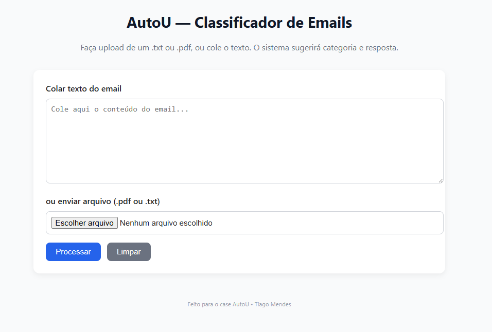

# 📧 AutoU — Classificador de Emails

Um sistema fullstack para **classificação automática de emails** e **geração de respostas sugeridas**.

- ⚡ Backend em **FastAPI** (Python)
- 🎨 Frontend em **React (Vite)**
- 🤖 Classificação inicial com **scikit-learn**
- ✨ Sugestões de resposta via **OpenAI API** (ou templates locais se não houver chave)


## - [Visite o App Online](https://email-analyzer-ten.vercel.app/)

---

## 🚀 Funcionalidades

- Upload de arquivo **.txt** ou **.pdf** (ou colar texto direto)
- Classificação do email como **Produtivo** ou **Improdutivo**
- Retorno de **confiança (%)** do classificador
- Geração de **resposta sugerida**
  - Se **OPENAI_API_KEY** estiver configurada → resposta gerada por LLM
  - Se **não houver chave** → usa **templates locais**
- Ações rápidas:
  - Copiar resposta para área de transferência
  - Baixar resposta em arquivo `.txt`




---

## 🛠️ Stack

### Backend
- Python 3.10+
- FastAPI
- scikit-learn
- nltk
- pdfminer.six
- openai

### Frontend
- React (Vite)
- CSS simples (sem frameworks externos)

---

## 📂 Estrutura do Projeto

```bash
autou-case/
│
├── backend/
│ ├── main.py # API principal (FastAPI)
│ ├── classifier.py # Modelo ML simples (TF-IDF + LogisticRegression)
│ ├── nlp_utils.py # Pré-processamento de texto (NLTK)
│ ├── openai_client.py # Integração com OpenAI (ou fallback local)
│ └── requirements.txt # Dependências Python
│
├── frontend/
│ ├── src/
│ │ ├── App.jsx
│ │ ├── components/
│ │ │ └── EmailForm.jsx
│ │ └── style.css
│ ├── index.html
│ └── package.json
│
└── README.md
```

---

## ⚙️ Instalação e Execução

### 🔹 1. Backend (FastAPI)

1. Entre na pasta:
   ```bash
   cd backend
   ```


2. Crie e ative um ambiente virtual:
   ```bash
    python -m venv venv
    source venv/bin/activate   # Linux/Mac
    venv\Scripts\activate      # Windows (PowerShell)
    ```


3. Instale as dependências:
   ```bash
    pip install -r requirements.txt
    ```


3. Instale as dependências:
   ```bash
    pip install -r requirements.txt
    ```


4. (Opcional) Configure a variável de ambiente OPENAI_API_KEY:
   ```bash
    export OPENAI_API_KEY=sk-xxxxxxx   # Linux/Mac
    setx OPENAI_API_KEY "sk-xxxxxxx"   # Windows
    ```


5. Rode o servidor:
   ```bash
    uvicorn main:app --reload
    ```

## 🚀 Servidor ativo em:

👉 http://localhost:8000

---

### 🔹 2. Frontend (React)

1. Entre na pasta:
   ```bash
   cd frontend
   ```


2. Instale dependências:
   ```bash
   npm install
   ```


3. Crie um arquivo .env na raiz do frontend:
   ```bash
   VITE_API_URL=http://localhost:8000
   ```


4. Rode o app:
   ```bash
   npm run dev
   ```


4. Rode o app:
   ```bash
   npm run dev
   ```

## 🚀 Frontend ativo em:

👉 http://localhost:5173

---


## 🧠 Funcionamento

1. O usuário envia um email (texto colado ou arquivo `.pdf`/`.txt`).
2. O **frontend** envia o conteúdo para o **backend** via `POST /api/process-email`.
3. O **backend** executa:
   - **Extração de texto** (com `pdfminer` para PDFs).
   - **Pré-processamento** (`nlp_utils` usando `nltk`).
   - **Classificação** (`classifier.py` com Logistic Regression).
   - **Geração de sugestão** (`openai_client.py`):
     - Se houver **API Key** → usa **OpenAI GPT**.
     - Se **não houver API Key** → usa **respostas prontas (templates)**.
4. O resultado (**categoria + confiança + resposta sugerida**) volta para o frontend.
5. O usuário pode **copiar** ou **baixar** a resposta.

---

## 📝 Exemplo de uso

### Entrada:

 #### Prezados, gostaria de solicitar a atualização do pedido 123 com urgência.


### Saída (sem API Key):

#### Categoria: Produtivo (87%)
#### Resposta sugerida:
#### 
#### Olá,
#### 
#### Obrigado pelo contato. Recebemos sua solicitação e já estamos analisando.
#### Em até 2 dias úteis retornaremos com uma posição mais detalhada.
#### 
#### Atenciosamente,
#### Equipe


---

## 📦 Deploy

- O **backend** pode ser publicado em qualquer serviço que rode Python (Heroku, Render, Railway, etc.).
- O **frontend** pode ser buildado e hospedado no Vercel, Netlify ou GitHub Pages:

```bash
npm run build
```

---


## 👨‍💻 Autor

**Tiago Mendes** — Desenvolvido como case técnico **AutoU**.


